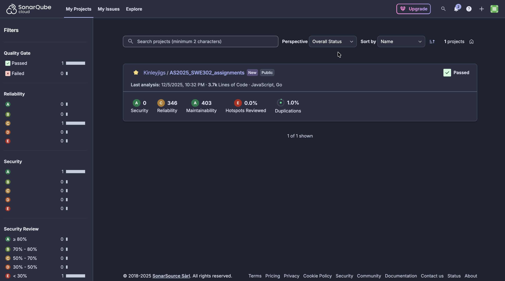
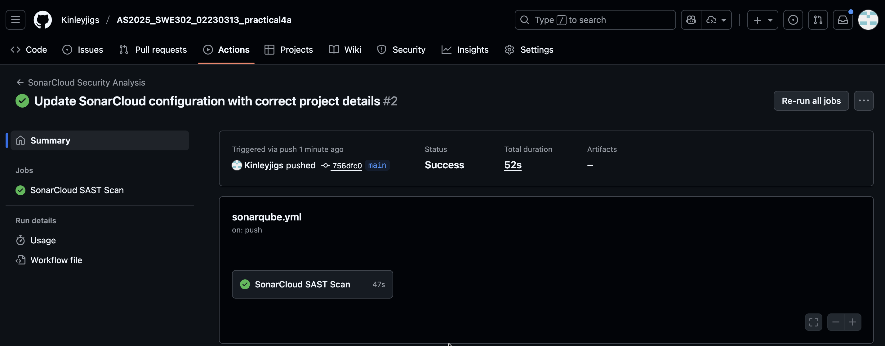

# Practical 4a: SonarCloud SAST Integration in GitHub Actions

This practical demonstrates automating source code security analysis by integrating SonarCloud SAST into GitHub Actions CI/CD pipelines.

---

### Objective

Implement automated Static Application Security Testing (SAST) using SonarCloud in GitHub Actions to detect source code vulnerabilities, security hotspots, and code quality issues early in the CI/CD pipeline.

---

### Project Overview

- **Application type:** Java Spring Boot REST API (cicd_demo1)
- **Primary goal:** Add automated SonarCloud scans for source code security and quality analysis
- **Key tools:** SonarCloud, GitHub Actions, Maven, JaCoCo

---

### Implementation

1. Created a SonarCloud account and generated authentication token stored as GitHub secret (`SONAR_TOKEN`).
2. Created `sonar-project.properties` with project key, organization, source paths, Java version, and coverage settings.
3. Updated `pom.xml` with SonarCloud Maven plugin (3.10.0.2594) and JaCoCo plugin for code coverage tracking.
4. Added `.github/workflows/sonarqube.yml` workflow to run SonarCloud scans on push and pull requests.
5. Configured workflow to checkout code with full history, build with Maven, run tests with coverage, and execute SonarCloud scan.

Example workflow step (simplified):

```yaml
- name: SonarCloud Scan
  env:
    GITHUB_TOKEN: ${{ secrets.GITHUB_TOKEN }}
    SONAR_TOKEN: ${{ secrets.SONAR_TOKEN }}
  run: |
    mvn sonar:sonar \
      -Dsonar.projectKey=Rynorbu_cicd_demo1 \
      -Dsonar.organization=rynorbu \
      -Dsonar.host.url=https://sonarcloud.io
```

---

### Testing & Validation

- Verified SonarCloud workflow runs on push and pull request triggers.
- Confirmed successful build, test execution, and code coverage generation.
- Validated SonarCloud scan completes and uploads results to dashboard.
- Checked security vulnerabilities, hotspots, and quality metrics appear in SonarCloud dashboard.
- Tested PR decoration showing inline security findings on pull requests.

---

### Evidence of Results


*SonarCloud dashboard showing security rating, vulnerabilities, code coverage, and quality metrics.*


*GitHub Actions workflow run showing SonarCloud scan execution and completion.*


*Branch-level analysis with quality gate enforcement and PR decoration.*

---

### Challenges Faced

- Token authentication failures — fixed by using correct secret name (`SONAR_TOKEN` not `SONARCLOUD_TOKEN`) and verifying token configuration.
- Project key mismatch errors — resolved by following SonarCloud naming convention `{organization}_{repository-name}`.
- Missing code coverage in dashboard — fixed by properly configuring JaCoCo plugin in `pom.xml` and running `mvn clean verify` before scan.
- Deciding workflow structure — created separate `sonarqube.yml` for modularity and independent execution.

---

### Lessons Learned

- SonarCloud focuses on source code analysis (vulnerabilities, code quality) while Snyk focuses on dependency vulnerabilities — both are complementary.
- Quality gates enforce security standards automatically, preventing insecure code from merging.
- PR decoration integrates security feedback into code review workflow, improving developer experience.
- Automated SAST provides consistent analysis and early vulnerability detection (shift-left security).

---

### Conclusion

Practical 4a demonstrates how to integrate SonarCloud SAST into GitHub Actions to provide automated source code security analysis, enforce quality gates, and surface findings in pull requests for early vulnerability detection.

---

### Repository

https://github.com/Kinleyjigs/AS2025_SWE302_02230313_practical4a 


