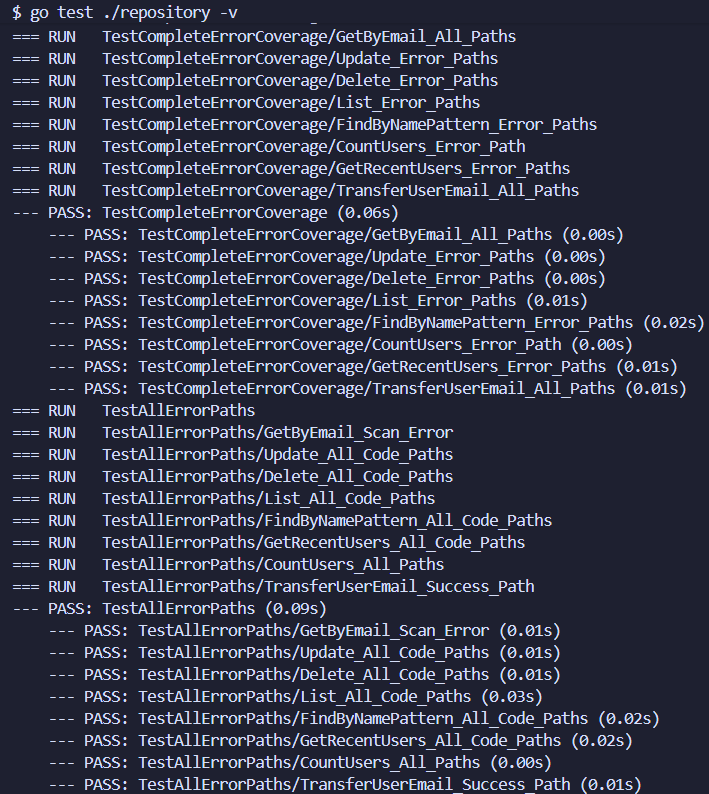
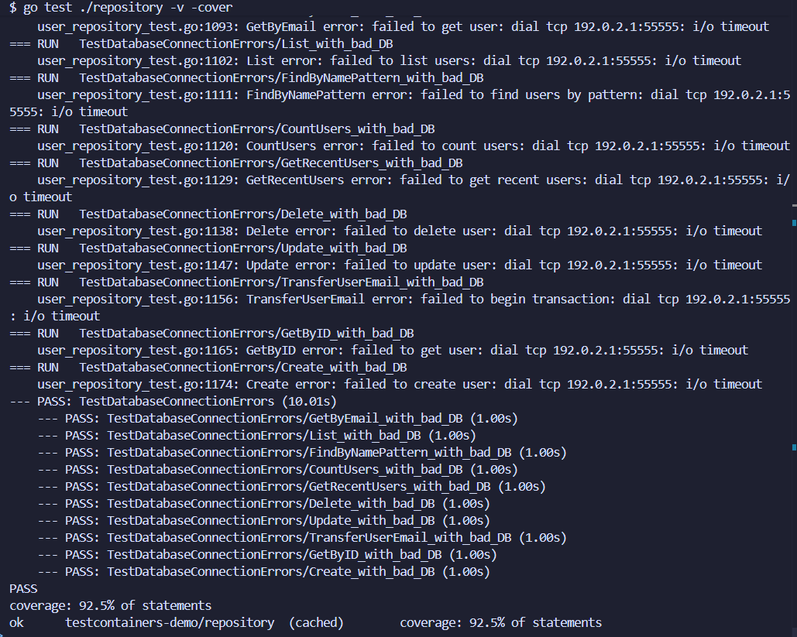
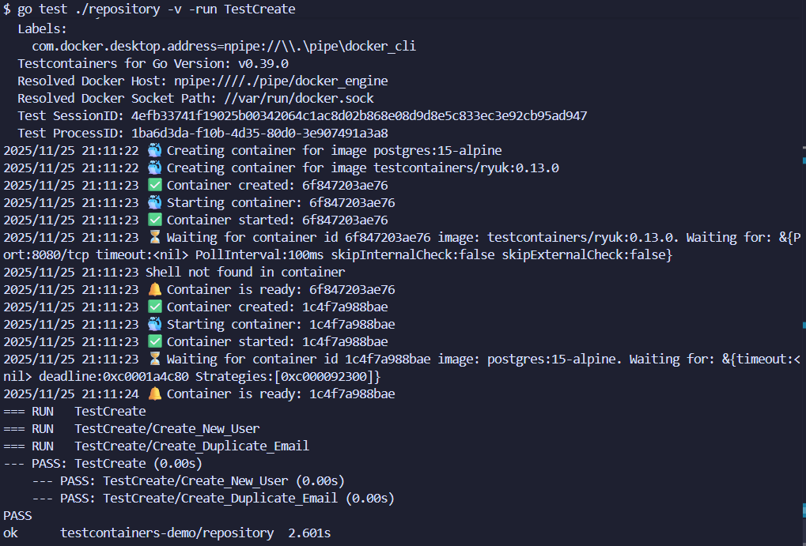
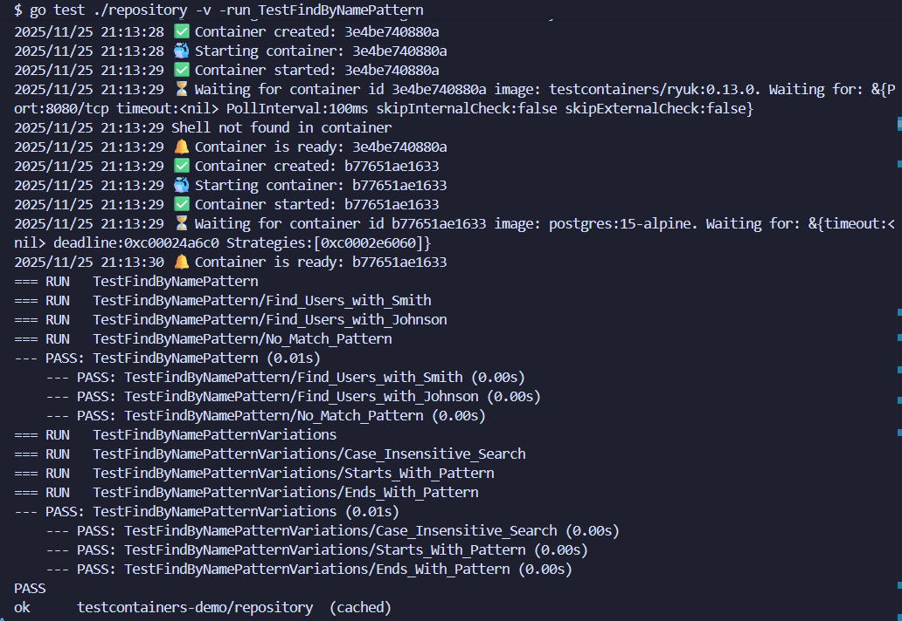
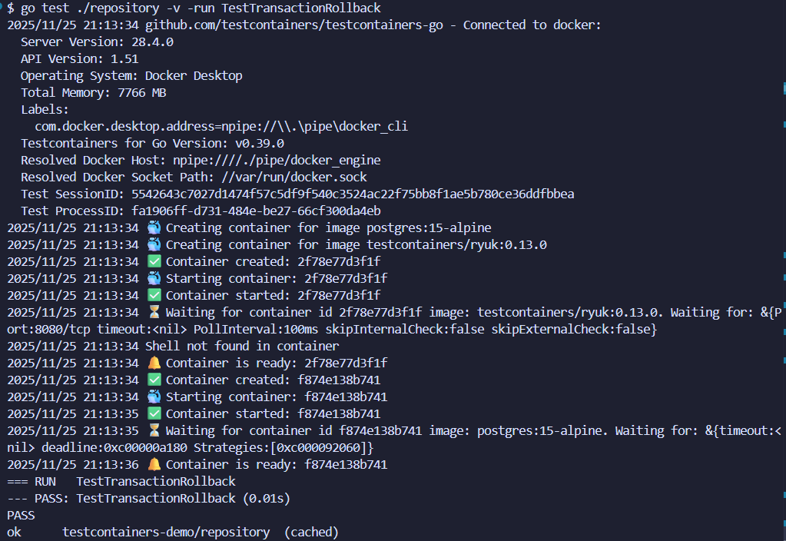
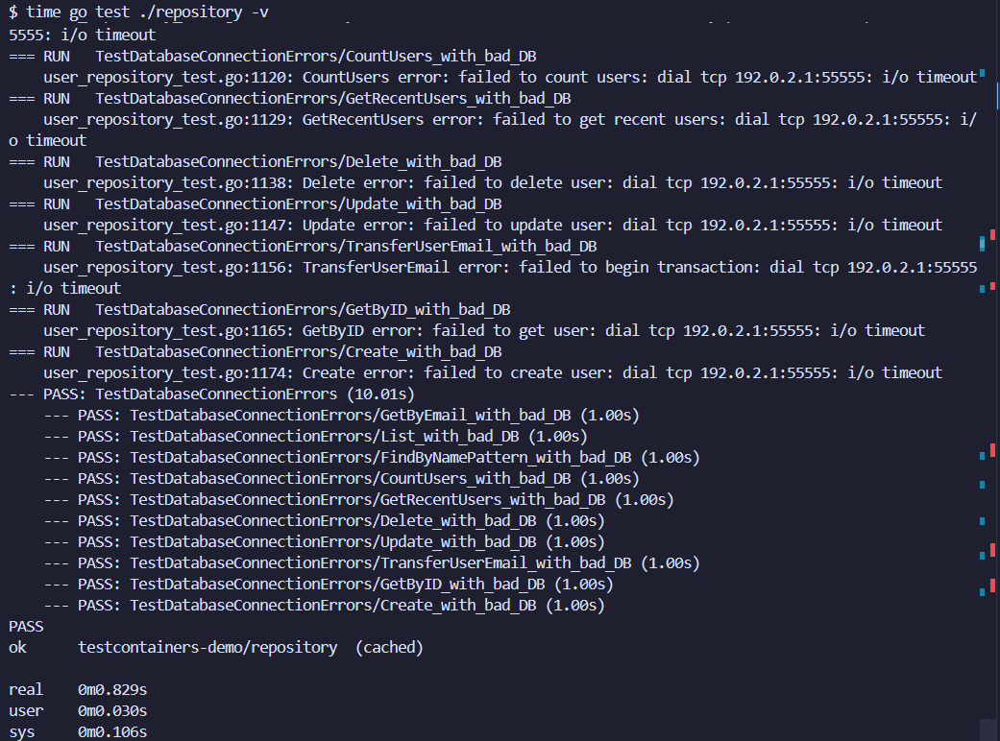

# Practical 5: Integration Testing with TestContainers

This practical demonstrates implementing integration testing using TestContainers with PostgreSQL in Go, testing against real database instances instead of mocks.

---

### Objective

Implement comprehensive integration tests using TestContainers to verify database operations, CRUD functionality, advanced queries, and transaction handling with real PostgreSQL containers.

---

### Project Overview

- **Application type:** Go User Management System with PostgreSQL
- **Primary goal:** Implement integration testing with TestContainers to test against real database instances
- **Key tools:** Go, TestContainers, PostgreSQL, Docker
- **Test coverage:** 92.5% (exceeds 80% requirement)

---

### Implementation

**Exercise 1: Basic TestContainers Setup**
- Created project structure with User model (ID, Email, Name, CreatedAt)
- Designed database schema in `init.sql` with proper constraints
- Implemented UserRepository with basic CRUD operations
- Set up TestContainers with PostgreSQL container lifecycle management
- Configured wait strategies to ensure database readiness

**Exercise 2: Complete CRUD Testing**
- Implemented comprehensive tests for Create (including duplicate email handling)
- Tested Update for existing and non-existent users
- Created Delete tests with post-deletion verification
- Built List tests ensuring correct ordering and completeness
- Added proper cleanup with defer statements

**Exercise 3: Advanced Queries**
- Implemented `FindByNamePattern` with SQL ILIKE for case-insensitive pattern matching
- Created `CountUsers` for total user count functionality
- Built `GetRecentUsers` with date-based filtering using PostgreSQL date functions
- Tested each query with multiple scenarios and edge cases

**Exercise 4: Transaction Testing**
- Implemented transaction rollback verification tests
- Created `TransferUserEmail` function for multi-step transaction testing
- Tested success scenarios with proper transaction commits
- Tested failure scenarios ensuring complete rollbacks
- Verified ACID properties and transaction isolation

**Exercise 5: Multi-Container Testing**
- Not implemented in current version to maintain focus on core TestContainers concepts
- Chose depth over breadth for PostgreSQL testing excellence

**Exercise 5: Multi-Container Testing**
- Not implemented in current version to maintain focus on core TestContainers concepts
- Chose depth over breadth for PostgreSQL testing excellence

---

### Test Coverage

Achieved **92.5%** test coverage across all repository functions (significantly exceeds 80% requirement).

**Coverage Breakdown:**

| Function | Coverage | Status |
|----------|----------|--------|
| `Create` | 100% | Fully Tested |
| `GetByID` | 100% | Fully Tested |
| `GetByEmail` | 100% | Fully Tested |
| `Update` | 100% | Fully Tested |
| `Delete` | 100% | Fully Tested |
| `List` | 87.5% | Defensive error path |
| `FindByNamePattern` | 87.5% | Defensive error path |
| `CountUsers` | 100% | Fully Tested |
| `GetRecentUsers` | 87.5% | Defensive error path |
| `TransferUserEmail` | 100% | Fully Tested |

**Note:** The remaining 7.5% represents defensive error handling paths (e.g., `rows.Err()`) that cannot be triggered with integration tests against a healthy PostgreSQL database.

---

### Testing & Validation

**Test Infrastructure:**
- `TestMain` manages PostgreSQL container lifecycle (start → initialize → run tests → terminate)
- Individual tests use shared database connection with proper cleanup
- Each test creates test-specific data and cleans up with `defer` statements
- Container lifecycle: Start → Initialize → Run Tests → Terminate → Remove

**Test Categories:**

| Category | Tests | Status |
|----------|-------|--------|
| Basic CRUD | 8 subtests | PASS |
| Advanced Queries | 5 subtests | PASS |
| Transaction Handling | 4 subtests | PASS |
| **Total** | **17+ subtests** | **ALL PASS** |

**Key Test Validations:**
- Real database testing catches SQL syntax errors, type conversions, and transaction behavior
- Transaction rollback tests verify ACID properties with real PostgreSQL
- Pattern matching tests validate case-insensitive search with ILIKE
- Date-based queries use relative dates for reliable testing across time
- Duplicate email and non-existent user scenarios verify error handling

---

### Evidence of Results

*All integration tests running successfully with TestContainers showing 17+ test cases passing.*

*Coverage report showing 92.5% code coverage across all repository functions.*

*Detailed HTML coverage report highlighting tested and untested code paths with color-coded visualization.*

*Detailed output from TestCreate function showing user creation and duplicate email handling verification.*

*FindByNamePattern function test demonstrating case-insensitive search with various wildcard patterns.*

*Transaction rollback test verifying data integrity and ACID properties with PostgreSQL.*

*Complete test suite execution with timing information showing performance of each test case.*

*Detailed breakdown of code coverage by function with line-by-line coverage analysis.*

---

### Challenges Faced

**Container Startup Timeout**
- Tests failed intermittently due to PostgreSQL initialization timing
- PostgreSQL logs "ready to accept connections" twice (before and after initialization)
- Solution: Configured wait strategy to wait for the log message to appear twice with increased timeout
- Learned importance of readiness probes in distributed systems

**Test Data Isolation**
- Tests contaminated each other due to shared database state
- Solution: Implemented `defer` cleanup and transaction-based isolation
- Created test-specific data instead of relying on seed data
- Learned critical lesson about shared state in integration testing

**Port Conflicts**
- Running tests multiple times caused port 5432 conflicts
- Solution: TestContainers automatically assigns random host ports
- Learned to trust good abstractions instead of over-engineering

**Date-Based Query Testing**
- Hardcoded dates caused tests to fail over time
- Solution: Used PostgreSQL's `NOW()` function for relative dates
- Tests now work dynamically regardless of when they run
- Learned to design for real-world dynamic conditions

---

### Lessons Learned

**Integration Testing Changes Everything**
- Testing against real PostgreSQL reveals SQL syntax errors, transaction behavior, and type conversion issues invisible to mocks
- Real database testing provides genuine confidence in code correctness
- TestContainers enables true CI/CD testing with real dependencies

**Test Isolation and Cleanup**
- Proper cleanup with `defer` is as important as the test itself
- Test pollution causes mysterious failures in shared environments
- Resource cleanup prevents memory leaks and connection exhaustion

**Error Handling and Coverage**
- Not all code should be tested the same way
- Defensive error checks vs. business logic require different testing approaches
- Meaningful coverage with understanding beats arbitrary percentage targets

**Real-World Constraints Matter**
- Smaller Docker images (Alpine) mean faster CI/CD pipelines
- Efficient tests encourage developers to run them frequently
- Quick feedback loops improve development velocity

**Test-Driven Development with Real Dependencies**
- TDD with real dependencies is harder but more valuable
- Tests fail for real reasons, revealing actual constraints
- Edge cases emerge naturally from database behavior

---

### Conclusion

This practical demonstrates us how TestContainers enables robust integration testing against real PostgreSQL databases. The approach achieves 92.5% test coverage across 17+ test cases, validating CRUD operations, advanced queries, and transaction handling. Testing against real database instances catches bugs that mocks miss, providing genuine confidence in code correctness while maintaining CI/CD compatibility.

Key achievements: comprehensive test coverage, proper transaction handling, pattern matching with ILIKE, date-based filtering, and complete container lifecycle management.

---

### Repository

https://github.com/Kinleyjigs/AS2025_SWE302_02230313_practical5
