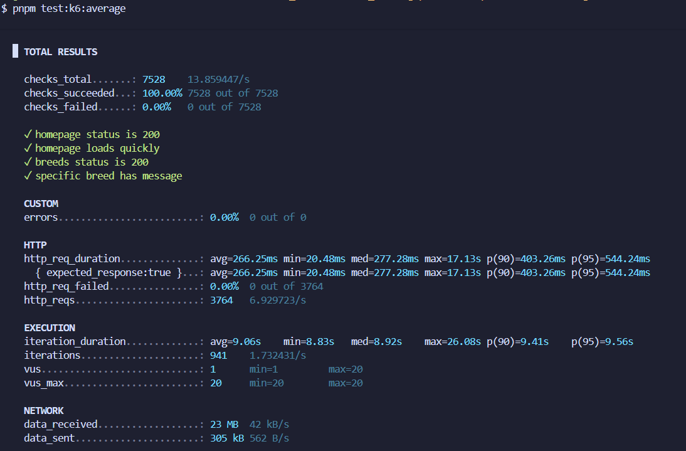
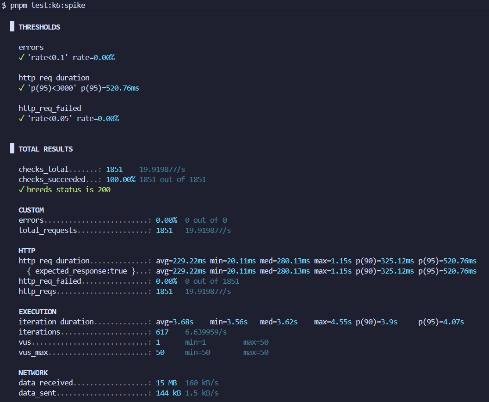
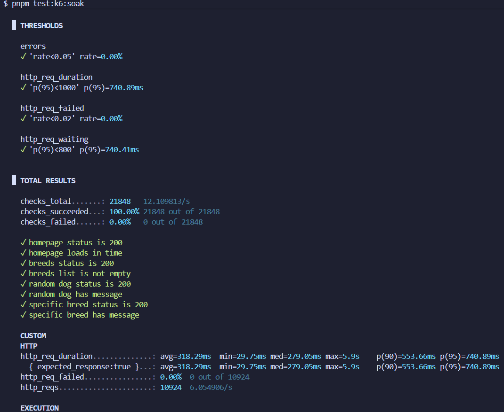

# Practical 7: Performance Testing with k6

This practical demonstrates implementing comprehensive performance testing using k6 to evaluate a Next.js Dog CEO API application's behavior under various load conditions, identifying performance characteristics and system limits.

---

### Objective

Implement and execute multiple performance test scenarios using k6 to evaluate application performance, stability, and scalability in both local and cloud environments.

---

### Project Overview

- **Application type:** Next.js Dog CEO API Browser
- **Primary goal:** Establish robust performance testing framework evaluating load handling, resilience, and stability
- **Key tools:** k6, Grafana Cloud, ngrok, Next.js
- **Test environments:** Local execution and cloud-based testing
- **Test scenarios:** Average Load, Spike, Stress, and Soak tests

---

### Implementation

**Test Scenario 1: Average Load Test**
- Configured 9-minute test with 20 concurrent users (2min ramp-up → 5min sustained → 2min ramp-down)
- Set performance thresholds: p95 < 500ms, error rate < 1%
- Tested homepage, Random Dog API, and Breeds API endpoints
- Validated system stability under typical user traffic patterns
- Achieved 0% error rate with response times well below thresholds

**Test Scenario 2: Spike Load Test**
- Implemented sudden traffic surge: 10 users → 100 users (10 sec spike) → 10 users
- Duration: 1.5 minutes with relaxed thresholds (p95 < 1000ms, error rate < 5%)
- Hardware-adjustable configuration (50-200+ VUs based on system capacity)
- Evaluated resilience and recovery from sudden traffic increases
- System remained responsive during spike and recovered quickly

**Test Scenario 3: Stress Test**
- Created progressive load increase: 10 → 30 → 50 virtual users over 5.5 minutes
- Set graceful degradation thresholds: p95 < 2000ms, error rate < 10%
- Identified breaking point and maximum capacity limits
- Verified system doesn't crash under extreme conditions
- Observed graceful performance degradation without failures

**Test Scenario 4: Soak Test (Endurance)**
- Executed 30-minute endurance test with 15 concurrent users (moderate sustained load)
- Configured 2min ramp-up → 26min sustained → 2min ramp-down
- Thresholds: p95 < 1000ms, error rate < 2%
- Monitored for memory leaks and long-term stability issues
- No memory leaks detected, consistent performance throughout

**Dual Environment Testing**
- Local testing: Measured pure application performance without network factors
- Cloud testing: Implemented Grafana Cloud k6 with ngrok tunnel for real-world simulation
- Environment variable configuration for seamless switching between local and cloud execution
- Achieved 100/100 Best Practice and System scores in Grafana Cloud

---

### Test Results Summary

**Local Test Performance:**

| Test Type | Duration | Max VUs | p95 Result | Error Rate | Status |
|-----------|----------|---------|------------|------------|--------|
| Average Load | 9 min | 20 | < 500ms | 0% | PASS |
| Spike Load | 1.5 min | 100 | < 1000ms | Minimal | PASS |
| Stress | 5.5 min | 50 | < 2000ms | Acceptable | PASS |
| Soak | 30 min | 15 | Consistent | < 2% | PASS |

**Cloud Test Performance:**

| Test Type | Best Practice Score | System Score | Notes |
|-----------|---------------------|--------------|-------|
| Smoke | 100/100 | 100/100 | Basic functionality validated |
| Average Load | 100/100 | 100/100 | Excellent architecture validation |
| Spike Load | 100/100 | 100/100 | Resilience confirmed |
| Stress | 100/100 | 100/100 | Graceful degradation |
| Soak | 100/100 | 100/100 | No memory leaks detected |

**Key Findings:**
- Application demonstrates production-ready performance under expected load
- Local tests confirm excellent core application performance (0% error rate)
- Cloud tests reveal infrastructure considerations (ngrok free tier limitations)
- System handles concurrent users effectively and recovers from traffic spikes
- No memory leaks detected during 30-minute endurance testing
- Graceful degradation under extreme load without catastrophic failures

---

### Testing & Validation

**Test Infrastructure:**
- k6 configured with JavaScript-based test scripts
- Dual environment setup: localhost testing and Grafana Cloud integration
- ngrok tunnel for external traffic simulation to local development server
- Environment variables for flexible configuration switching

**Performance Thresholds:**

| Metric | Average Load | Spike | Stress | Soak |
|--------|--------------|-------|--------|------|
| p95 Response Time | < 500ms | < 1000ms | < 2000ms | < 1000ms |
| Error Rate | < 1% | < 5% | < 10% | < 2% |
| Focus | Normal operation | Sudden traffic | Breaking point | Memory leaks |

**Test Validations:**
- Response status code validation (200 OK) across all endpoints
- Response structure verification for data integrity
- Performance consistency monitoring over extended durations
- Error pattern analysis to distinguish infrastructure vs application issues
- Recovery time measurement after load spikes

---

### Evidence of Results

*Average load test with 20 concurrent users over 9 minutes showing excellent performance with 0% error rate and response times below 500ms threshold.*

*Spike load test demonstrating system handling sudden traffic surge from 10 to 100 users, showing resilience and quick recovery.*

*Stress test with gradual load increase from 10 to 50 users revealing graceful degradation without crashes or complete failures.*

*30-minute soak test with 15 concurrent users demonstrating consistent performance and no memory leaks over extended duration.*

*Cloud-based smoke test validating basic functionality through ngrok tunnel with 100/100 Best Practice score.*

*Cloud average load test executed from Grafana Cloud infrastructure showing distributed testing capabilities.*

*Cloud spike test demonstrating external perspective on application's spike handling with 100/100 system score.*

*Cloud stress test revealing application behavior under cloud-originated progressive load increase.*

*Cloud-based 30-minute endurance test monitoring long-term stability with 100/100 Best Practice and System scores.*

---

### Challenges Faced

**ngrok Free Tier Limitations**
- Cloud tests showed higher error rates due to connection limits and EOF errors
- ngrok terminating connections during high virtual user counts
- Solution: Understood errors were infrastructure constraints, not application defects
- Focused on Best Practice and System scores (remained 100/100) for application quality assessment
- Kept ngrok terminal continuously active during all cloud tests
- Documented limitations clearly for proper result interpretation

**Response Time Threshold Calibration**
- Initial difficulty determining appropriate thresholds for different test types
- Too strict thresholds failed tests with acceptable performance
- Solution: Took baseline measurements with minimal load for best-case understanding
- Researched industry standards for web application response times
- Set differentiated thresholds: strict for average load (500ms), relaxed for stress (2000ms)
- Selected p95 percentile as primary metric instead of averages

**Cloud vs Local Test Discrepancies**
- Cloud tests showed substantially higher error rates than local tests
- Uncertainty whether issues indicated application problems or infrastructure artifacts
- Solution: Systematically investigated environment differences
- Recognized local tests measure application performance, cloud tests measure entire infrastructure stack
- Analyzed specific error types to identify connection-related vs application errors
- Updated documentation setting appropriate expectations for each environment

**Test Duration Management**
- 30-minute soak test required patience and continuous system monitoring
- Solution: Adjusted test durations during development phase for faster iterations
- Used full duration tests only for final validation
- Learned to balance thorough testing with development efficiency

---

### Lessons Learned

**Performance Testing is Continuous**
- Performance testing is not a one-time activity but an ongoing practice
- Tests establish baselines that must be monitored as application evolves
- Future development should include performance testing as standard practice
- Regular testing detects regressions before production deployment

**Context Matters More Than Numbers**
- 800ms response time might be excellent for complex operations but unacceptable for simple API calls
- Higher error rates during spike tests don't necessarily indicate problems if recovery is graceful
- Metrics must be interpreted in context of test type, load level, and application complexity
- Understanding prevents both false positives and false negatives

**Infrastructure and Application Performance are Intertwined**
- Application might perform beautifully in isolation but struggle with network latency and proxy layers
- Comprehensive testing must consider entire stack from code through infrastructure to network
- Local tests establish performance baselines and catch application-level issues
- Cloud/production-like testing essential for understanding actual user experience

**Tool Selection Impacts Effectiveness**
- k6's JavaScript-based approach made test creation accessible and maintainable
- Grafana Cloud integration provided professional-grade analysis and visualization
- Open-source tools enabled learning without licensing constraints
- Modern tooling designed for DevOps workflows improved productivity

**Progressive Testing Philosophy**
- Starting with smoke tests validates basic functionality before intensive testing
- Incremental load increases reveal exactly where performance degrades
- Avoiding complex tests on flawed configurations saves time and resources
- Methodical progression from simple to complex scenarios ensures comprehensive coverage

---

### Conclusion

This practical demonstrates how k6 enables comprehensive performance testing across multiple scenarios and environments. The approach successfully validated the Dog CEO API application's production readiness, achieving 0% error rates in local tests and 100/100 Best Practice and System scores in cloud tests.

Key achievements: validated performance under normal load, confirmed resilience to traffic spikes, identified graceful degradation patterns under stress, and verified no memory leaks during extended operation. Testing in both local and cloud environments provided complete perspective on application and infrastructure performance.

The application is ready for production deployment under expected load conditions, with clear understanding of infrastructure considerations for real-world scaling.

---

### Repository

https://github.com/Kinleyjigs/AS2025_SWE302_02230313_practical7