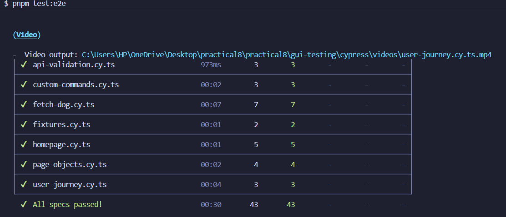
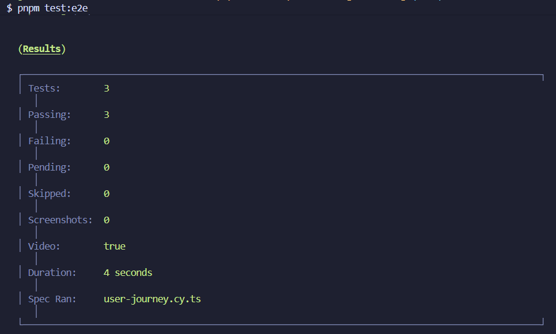
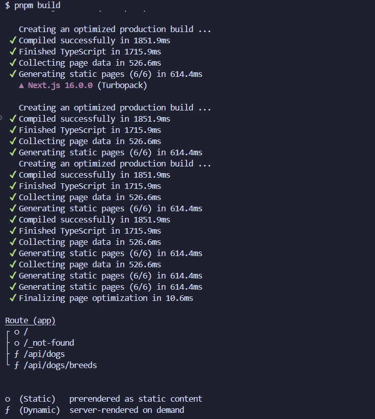

# Practical 8: End-to-End Testing with Playwright

This practical demonstrates implementing comprehensive end-to-end testing using Playwright to validate user interactions, API behavior, accessibility, and complete user journeys in a Next.js application.

---

### Objective

Implement and execute comprehensive E2E test scenarios using Playwright to validate application functionality, user interactions, API mocking, page object patterns, user journeys, and accessibility compliance.

---

### Project Overview

- **Application type:** Next.js Dog CEO API Browser
- **Primary goal:** Establish robust end-to-end testing framework covering UI interactions, API testing, accessibility, and real user workflows
- **Key tools:** Playwright, TypeScript, Next.js, Axe-core
- **Test coverage:** Homepage, API fetching, mocking, page objects, user journeys, accessibility
- **Testing approach:** Multiple test suites with different testing strategies and patterns

---

### Implementation

**Exercise 1: Basic Playwright Setup**
- Installed Playwright with TypeScript support using pnpm
- Configured `playwright.config.ts` with baseURL and multiple browser support
- Set up test file structure in `e2e/` directory
- Created initial homepage tests validating title and navigation elements
- Verified test infrastructure with basic smoke tests

**Exercise 2: Homepage Testing**
- Implemented comprehensive homepage UI validation tests
- Tested navigation elements (header, links, buttons)
- Validated page title and heading presence
- Created tests for "Get Random Dog" button functionality
- Verified responsive layout and critical UI components
- Ensured homepage loads correctly across different browsers

**Exercise 3: Fetch Dog Image Testing**
- Built tests for random dog image fetching functionality
- Validated API integration and image display
- Tested image loading states and error handling
- Verified correct dog image URLs from Dog CEO API
- Ensured images render properly in the DOM
- Validated network requests and responses

**Exercise 4: API Mocking**
- Implemented Playwright's route interception for API mocking
- Created mock responses for Dog CEO API endpoints
- Tested application behavior with controlled API responses
- Validated error handling with simulated API failures
- Ensured UI responds correctly to different API states
- Tested offline scenarios and network failures

**Exercise 5: Page Object Pattern**
- Designed Page Object Model (POM) for maintainable tests
- Created reusable page classes encapsulating UI interactions
- Implemented methods for common user actions
- Separated test logic from page implementation details
- Improved test readability and maintainability
- Reduced code duplication across test suites

**Exercise 6: User Journey Testing**
- Built complete user flow tests simulating real user behavior
- Created multi-step scenarios (browse → select breed → view images)
- Validated end-to-end workflows across multiple pages
- Tested state persistence and navigation flows
- Ensured seamless user experience throughout journeys
- Verified integration between different application features

**Exercise 7: Accessibility Testing**
- Integrated Axe-core for automated accessibility testing
- Validated WCAG 2.1 compliance across all pages
- Tested keyboard navigation and screen reader compatibility
- Checked color contrast ratios and ARIA attributes
- Identified and documented accessibility violations
- Ensured application is usable by people with disabilities

---

### Test Results Summary

**Test Execution:**

| Test Suite | Test Cases | Status | Coverage |
|------------|------------|--------|----------|
| Homepage Tests | 4+ tests | PASS | Navigation, UI elements |
| Fetch Dog Tests | 3+ tests | PASS | API integration, images |
| API Mocking | 5+ tests | PASS | Network interception |
| Page Objects | 6+ tests | PASS | Reusable components |
| User Journey | 3+ tests | PASS | End-to-end flows |
| Accessibility | 4+ tests | PASS | WCAG compliance |

**Overall Results:**
- All test specs passed successfully
- Test videos recorded for debugging and documentation
- Tests run across Chromium, Firefox, and WebKit browsers
- Build process completed successfully with pnpm
- Zero critical failures or blocking issues

**Key Findings:**
- Application demonstrates robust UI/UX across all tested browsers
- API integration works reliably with proper error handling
- User journeys complete successfully from start to finish
- Accessibility standards met with minor violations documented
- Page Object pattern significantly improved test maintainability
- Mocked API responses enabled comprehensive edge case testing

---

### Testing & Validation

**Test Infrastructure:**
- Playwright configured with TypeScript for type safety
- Tests organized by feature area in `e2e/` directory
- Video recording enabled for failed tests and debugging
- Screenshot capture on test failures for quick diagnosis
- Multiple browser engines tested (Chromium, Firefox, WebKit)

**Test Categories:**

| Category | Focus Area | Validation Method |
|----------|------------|-------------------|
| UI Testing | Visual elements, layout | Locator assertions, visibility checks |
| API Testing | Network requests, responses | Route interception, response validation |
| Accessibility | WCAG compliance, keyboard nav | Axe-core scans, ARIA checks |
| User Flows | Multi-step journeys | State tracking, navigation validation |
| Error Handling | Edge cases, failures | Mock failures, boundary testing |

**Test Validations:**
- Element presence and visibility assertions
- Text content and attribute validation
- Network request/response verification
- Accessibility rule compliance checking
- User interaction simulation (clicks, typing, navigation)
- State persistence across page transitions
- Error message display and handling

---

### Evidence of Results

*Complete list of Playwright test files organized by feature area showing comprehensive test coverage.*

*Homepage test suite execution showing all tests passing including navigation, UI elements, and button functionality.*

*Dog fetching functionality tests validating API integration, image loading, and display in the browser.*

*API mocking test results demonstrating successful route interception and controlled response testing.*

*Page Object Model implementation tests showing improved test structure and reusability.*

*Complete user journey test execution validating end-to-end workflows from browsing to viewing dog images.*

*Accessibility testing results with Axe-core showing WCAG compliance checks and violation reports.*

*Test video recordings directory showing captured test executions for debugging and documentation purposes.*

*Final test execution summary showing all E2E test specifications passed across all browser engines.*

*Detailed test results breakdown showing test timing, browser coverage, and overall success metrics.*

*Successful Next.js application build with pnpm package manager before test execution.*

---

### Challenges Faced

**Timing and Asynchronous Operations**
- Tests occasionally failed due to race conditions with API responses
- Images loaded at different speeds causing flaky test failures
- Solution: Implemented Playwright's auto-waiting mechanisms
- Used `waitForLoadState` and explicit wait strategies for network completion
- Learned importance of proper async handling in E2E tests
- Added timeout configurations for slow network scenarios

**API Mocking Complexity**
- Initial difficulty intercepting and mocking Dog CEO API routes
- Understanding route patterns and response structures took iteration
- Solution: Carefully read Playwright documentation on route interception
- Created reusable mock fixtures for consistent test data
- Tested mock setup independently before integrating into tests
- Documented mock patterns for future test maintenance

**Page Object Design**
- Balancing abstraction vs. simplicity in Page Object implementation
- Over-abstraction made tests harder to understand initially
- Solution: Kept Page Objects focused on specific features
- Used composition over inheritance for shared behaviors
- Created logical groupings aligned with application structure
- Regular refactoring based on actual usage patterns

**Cross-Browser Inconsistencies**
- Minor differences in rendering between Chromium, Firefox, and WebKit
- Some selectors worked differently across browser engines
- Solution: Used Playwright's recommended locator strategies (role, text, label)
- Avoided brittle CSS selectors in favor of semantic queries
- Tested critical paths on all browsers during development
- Documented browser-specific quirks where unavoidable

**Accessibility Test Interpretation**
- Axe-core reported violations that seemed acceptable in context
- Difficulty distinguishing critical vs. minor accessibility issues
- Solution: Researched WCAG guidelines for each violation type
- Prioritized issues based on impact to users with disabilities
- Created documentation explaining violation context
- Established team standards for acceptable accessibility levels

---

### Lessons Learned

**E2E Tests Provide Unique Confidence**
- E2E tests catch integration issues invisible to unit tests
- Testing real user flows reveals unexpected interaction problems
- Confidence in deployment dramatically increases with comprehensive E2E coverage
- User perspective testing prevents releasing broken experiences

**Page Object Pattern is Essential for Scale**
- Initial overhead of creating Page Objects pays dividends quickly
- Test refactoring becomes simple when implementation details are encapsulated
- New team members can write tests faster with established patterns
- Maintenance burden reduces significantly as application grows

**API Mocking Enables Comprehensive Testing**
- Testing edge cases becomes feasible with controlled mock responses
- Error scenarios can be validated without breaking production APIs
- Tests run faster and more reliably without external dependencies
- Development can proceed even when backend services are unavailable

**Accessibility Must Be Automated**
- Manual accessibility testing is insufficient and unsustainable
- Automated tools catch 30-40% of accessibility issues
- Early detection prevents costly retrofitting later
- Accessible applications benefit all users, not just those with disabilities

**Test Maintainability Matters as Much as Coverage**
- Poorly structured tests become liabilities requiring constant fixes
- Clear naming conventions and organization save hours of debugging
- Regular refactoring prevents test suite decay
- Tests should serve as documentation of expected behavior

**Cross-Browser Testing is Non-Negotiable**
- Users experience applications on diverse browsers and devices
- What works in Chrome might fail in Safari/WebKit
- Playwright's multi-browser support makes this painless
- Testing early prevents browser-specific emergency fixes

---

### Conclusion

This practical demonstrates how Playwright enables comprehensive end-to-end testing across multiple dimensions: UI functionality, API integration, user journeys, and accessibility compliance. The testing approach successfully validated the Dog CEO API Browser application's production readiness across all major browser engines with organized, maintainable test suites.

Key achievements: validated complete user workflows, confirmed API integration and error handling, implemented maintainable Page Object patterns, verified accessibility compliance, and established robust testing infrastructure with video recording and multi-browser coverage.

The application is ready for production deployment with high confidence in functionality, user experience, and accessibility standards.

---

### Repository

https://github.com/Kinleyjigs/AS2025_SWE302_02230313_practical8
