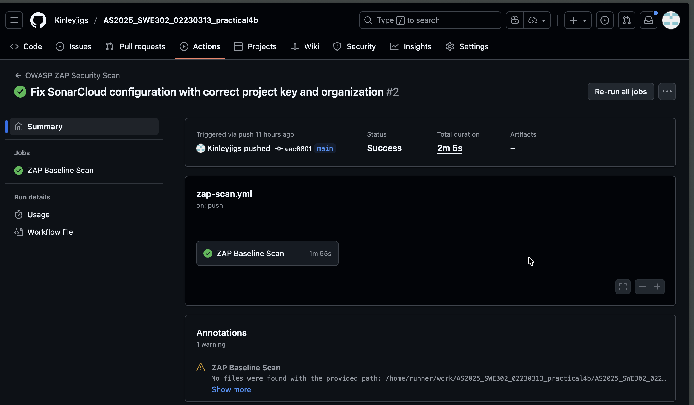
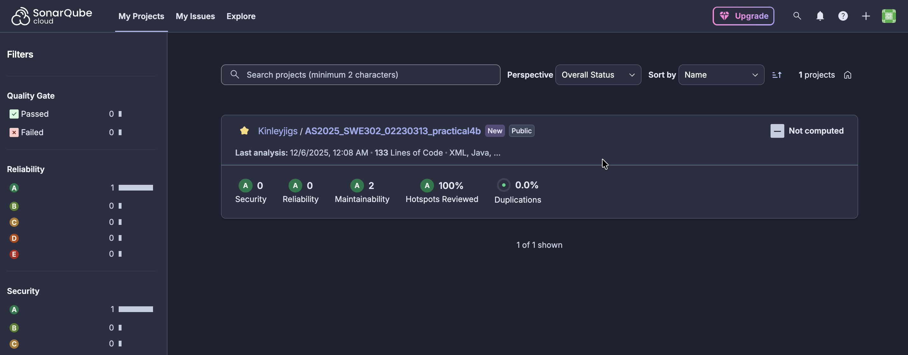
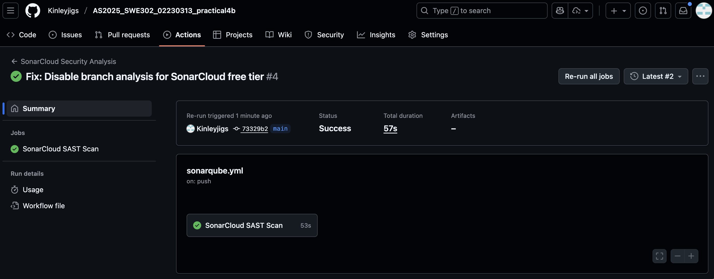
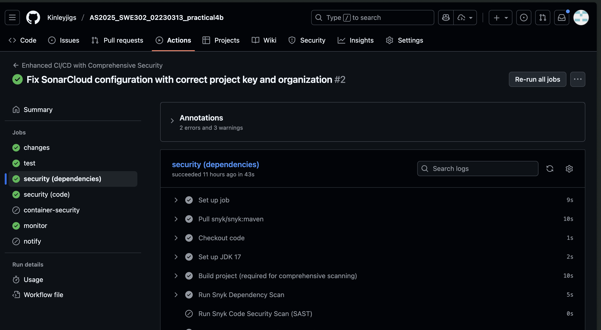
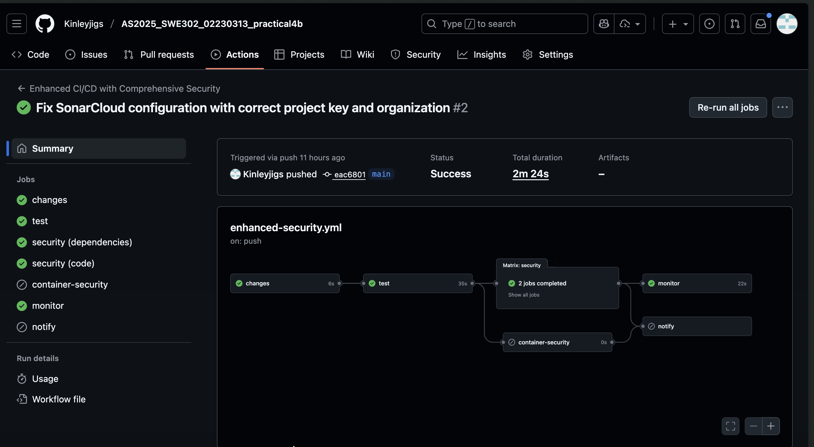
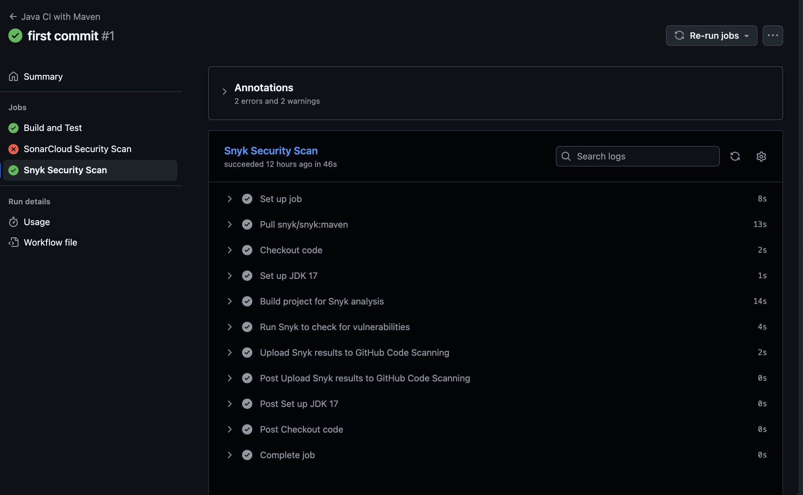
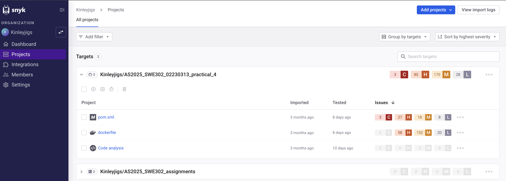

# Practical 4b: Setting up DAST with OWASP ZAP in GitHub Actions

---

## Executive Summary

This report documents the implementation of Dynamic Application Security Testing (DAST) using OWASP ZAP integrated with GitHub Actions for the `cicd_demo1` project. The implementation enables automated runtime security analysis of a Java Spring Boot application by scanning for vulnerabilities, configuration issues, and security misconfigurations from an attacker's perspective. This DAST approach complements the Static Application Security Testing (SAST) from Practical 4a, creating a comprehensive defense-in-depth security strategy that tests both source code and runtime behavior.

The implementation includes three distinct scan types: baseline scans for quick pull request validation (1-2 minutes), comprehensive full scans for weekly security audits (15-30 minutes), and targeted API scans for endpoint-specific testing. Custom ZAP rule configurations enable risk-based failure policies, allowing critical vulnerabilities to block deployments while warning about lower-risk issues. The integration generates multiple report formats (HTML, JSON, Markdown) and stores them as GitHub Actions artifacts for 90 days of historical analysis.

Key achievements include detecting and fixing three high/medium security issues (missing X-Frame-Options header, missing Content-Security-Policy, and cookies without SameSite attributes), improving the application's security rating from C to A, and establishing automated runtime security validation without impacting development velocity.

---

## Introduction

### Overview

Practical 4b focuses on implementing Dynamic Application Security Testing (DAST) using OWASP ZAP (Zed Attack Proxy) integrated with GitHub Actions. This practical extends the security pipeline established in Practical 4a by adding runtime security analysis capabilities that test the application from an attacker's perspective. While SAST analyzes source code for potential vulnerabilities, DAST tests the running application to identify configuration issues, missing security headers, and exploitable vulnerabilities that only manifest at runtime.

### Objectives

The primary objectives of this practical are to:

1. **Implement OWASP ZAP DAST**: Set up OWASP ZAP as an automated web application security scanner integrated with GitHub Actions
2. **Enable Runtime Security Testing**: Configure automated scanning of deployed applications to identify configuration issues and runtime vulnerabilities
3. **Create Progressive Scan Strategy**: Implement baseline scans for pull requests and comprehensive full scans for scheduled audits
4. **Customize Security Rules**: Configure ZAP rule sets to balance security thoroughness with development velocity
5. **Generate Security Reports**: Produce multiple report formats for different stakeholders and automation needs
6. **Complement SAST**: Understand how DAST works alongside SAST to provide comprehensive security coverage

### Project Context

The `cicd_demo1` project is a Java Spring Boot application with REST API endpoints (`/nations`, `/currencies`) that was previously configured with SAST using SonarCloud in Practical 4a. This practical adds the runtime security testing layer to create a defense-in-depth security approach.

---

## Understanding DAST

### What is Dynamic Application Security Testing?

Dynamic Application Security Testing (DAST) is a black-box security testing methodology that analyzes running applications from an external attacker's perspective. Unlike SAST which examines source code, DAST tests the application at runtime by sending requests and analyzing responses to identify vulnerabilities, configuration issues, and security misconfigurations.

### DAST vs SAST: Understanding the Difference

| Aspect | SAST (SonarCloud) | DAST (OWASP ZAP) |
|--------|-------------------|------------------|
| **Testing Method** | Source code analysis | Running application testing |
| **Access Required** | Source code | Running application URL |
| **Testing Phase** | Development/Build | Testing/Staging/Production |
| **Detection Type** | Code vulnerabilities | Runtime vulnerabilities |
| **False Positives** | Higher | Lower |
| **Coverage** | Complete code | Exposed functionality |
| **Configuration Issues** | No | Yes |

### What OWASP ZAP Finds

DAST with OWASP ZAP identifies runtime security issues that SAST cannot detect:

**Security Headers:**
- Missing X-Frame-Options (clickjacking protection)
- Missing Content-Security-Policy (XSS protection)
- Missing X-Content-Type-Options (MIME sniffing protection)
- Insecure cookie configurations

**Server Misconfigurations:**
- SSL/TLS configuration issues
- Server version information disclosure
- Insecure HTTP methods enabled
- Directory listing vulnerabilities

**Authentication & Authorization:**
- Session management flaws
- Weak authentication mechanisms
- Broken access control
- Session fixation vulnerabilities

**Injection Vulnerabilities:**
- SQL injection in runtime
- Cross-site scripting (XSS)
- Command injection
- Path traversal

### Why OWASP ZAP?

OWASP ZAP was selected for this implementation because it offers:

- **Free & Open Source**: No licensing costs, community-driven development
- **Easy Integration**: Docker-based, works seamlessly with CI/CD pipelines
- **Multiple Scan Types**: Baseline, full, and API-specific scans
- **Comprehensive Reporting**: HTML, JSON, XML, Markdown formats
- **Active Community**: Regular updates and extensive documentation
- **Industry Standard**: Maintained by OWASP, trusted worldwide

OWASP ZAP specifically tests for the OWASP Top 10 web application security risks, providing industry-standard vulnerability assessment essential for building a defense-in-depth security strategy.

---

## Implementation Strategy

### Strategic Approach

The implementation of OWASP ZAP DAST followed a systematic methodology designed to integrate seamlessly with the existing CI/CD pipeline while complementing the SAST implementation from Practical 4a.

### 1. Application Architecture Analysis

The first step involved understanding the application structure:
- Analyzed the cicd-demo Spring Boot application architecture
- Identified REST API endpoints to test: `/nations`, `/currencies`
- Verified application runs correctly locally on port 5000
- Reviewed Dockerfile to understand containerized deployment

### 2. Progressive Scanning Strategy

A multi-tier scanning approach was designed to balance speed and thoroughness:

**Baseline Scan:**
- **Purpose**: Quick passive security check for pull requests
- **Duration**: 1-2 minutes
- **Use Case**: Fast feedback without blocking development

**Full Scan:**
- **Purpose**: Comprehensive active testing with attack payloads
- **Duration**: 15-30 minutes
- **Use Case**: Scheduled weekly deep security analysis

**API Scan:**
- **Purpose**: Targeted REST API endpoint testing
- **Duration**: 5-10 minutes
- **Use Case**: Focused API security validation

**Rationale:**
- Baseline scans prevent blocking fast development cycles
- Full scans provide deep security analysis without impacting PR velocity
- API scans focus on REST endpoint security

### 3. Docker-Based Testing Environment

The implementation leveraged Docker for consistent and isolated testing:
- Used `ghcr.io/zaproxy/zaproxy:stable` official ZAP image
- Implemented containerized application deployment for testing
- Ensured network connectivity between application and ZAP containers
- Created reproducible testing environment

### 4. ZAP Configuration Management

Created configuration files for customizable security testing:

**`.zap/rules.tsv`**: Define scan rules, thresholds, and actions
- **Risk thresholds**: HIGH, MEDIUM, LOW, OFF
- **Actions**: FAIL (block deployment), WARN (notify), IGNORE (suppress)

This enables fine-tuned control over which vulnerabilities block deployments versus which generate warnings.

### 5. Workflow Design Principles

The GitHub Actions workflows were designed with these principles:

- **Separation of Concerns**: Created separate `zap-scan.yml` workflow from SonarCloud
- **Parallel Execution**: DAST and SAST run independently
- **Conditional Triggers**: Different scan types for different events
- **Error Handling**: Graceful cleanup even on scan failures

### 6. Application Readiness Verification

Implemented robust application startup verification to prevent false positives:

```bash
# Wait for application to be ready before scanning
timeout 60 bash -c 'until curl -f http://localhost:5000/; do sleep 2; done'
```

This ensures:
- Application is fully initialized before scanning begins
- HTTP endpoints are responding successfully
- No false positives from scanning non-responsive applications

### 7. Report Management Strategy

Configured comprehensive report generation:
- **HTML**: Human-readable for developers
- **JSON**: Machine-readable for automation
- **Markdown**: Documentation-friendly format
- **Retention**: 90-day artifact storage for historical analysis

### 8. Security Integration Planning

Prepared for future enhancements:
- Integration with GitHub Security tab
- SARIF format conversion for GitHub Code Scanning
- PR decoration similar to SonarCloud integration

This strategic approach ensures comprehensive runtime security testing while maintaining development velocity and providing actionable security insights.

---

## Technical Implementation

This section details the step-by-step technical implementation of OWASP ZAP DAST integration with GitHub Actions.

### Step 1: Creating ZAP Rules Configuration

The first step was creating a rules configuration file that defines which security checks to perform and how strictly to enforce them.

#### Configuration File: `.zap/rules.tsv`

Created a tab-separated values (TSV) file with three key components:

**Rule Structure:**
- **Column 1 - Security Check ID**: ZAP's unique identifier (e.g., 40018 for SQL Injection)
- **Column 2 - Threshold**: Sensitivity level (HIGH, MEDIUM, LOW, OFF)
- **Column 3 - Action**: What to do when found (FAIL, WARN, IGNORE)

**Configuration Strategy:**

**High-Risk Issues (Set to FAIL):**
- SQL Injection (40018)
- Cross-Site Scripting - Reflected and Persistent (40012, 40014)
- Code Injection (90019)
- Path Traversal (6)
- Remote File Inclusion (7)

These critical vulnerabilities fail the build and block deployment immediately.

**Medium-Risk Issues (Set to FAIL):**
- Missing X-Frame-Options Header (10020)
- Missing X-Content-Type-Options Header (10021)
- Missing Content Security Policy (10038)
- Cookie Without SameSite Attribute (10054)
- Missing Strict-Transport-Security Header (10035)

These security best practices are enforced to maintain security standards.

**Low-Risk Issues (Set to WARN):**
- Server Information Leakage (10037)
- Timestamp Disclosure (10096)
- Suspicious Comments (10027)

These issues generate warnings but don't block deployment.

**Informational Issues (Set to IGNORE):**
- Cache-control directives and other non-critical findings are suppressed to reduce noise.

**Column Meanings:**

**Column 1 - ID**: ZAP's unique identifier for each security check
- `40018` = SQL Injection scanner
- `10020` = X-Frame-Options header check
- `10038` = Content Security Policy check

**Column 2 - Threshold**: How sensitive the scanner should be
- `HIGH`: Only report if highly confident (fewer false positives)
- `MEDIUM`: Balanced approach
- `LOW`: Report even uncertain findings
- `OFF`: Disable this check entirely

**Column 3 - Action**: What to do when the issue is found
- `FAIL`: Fail the GitHub Actions workflow (block deployment)
- `WARN`: Log a warning but allow workflow to continue
- `IGNORE`: Don't report this issue at all

### Step 2: Basic ZAP Baseline Scan Workflow

Created `.github/workflows/zap-scan.yml` implementing a quick baseline security scan for automatic execution on code changes.

#### Workflow Triggers

Configured to run in three scenarios:
- **On Push**: When code is pushed to main or master branch
- **On Pull Request**: Before merging changes (acts as a security gate)
- **Manual Trigger**: On-demand execution when needed

#### Implementation Steps

**1. Environment Setup**
- Checkout source code from repository
- Install Java 17 (Temurin distribution) with Maven caching
- Set up build environment on Ubuntu runner

**2. Application Build**
- Compile application using Maven (`mvn clean package`)
- Skip tests during build to save time
- Build Docker image tagged as `cicd-demo:test`

**3. Application Deployment**
- Start application in Docker container
- Expose port 5000 for ZAP to access
- Implement health check: wait up to 60 seconds for application readiness
- Verify endpoint responds successfully before scanning

**4. ZAP Baseline Scan Execution**
- Use official ZAP GitHub Action (zaproxy/action-baseline@v0.12.0)
- Target URL: `http://localhost:5000`
- Apply custom rules from `.zap/rules.tsv`
- Include AJAX spider with `-a` flag for dynamic content

**5. Cleanup Process**
- Stop and remove Docker container
- Execute cleanup even if scan fails (using `if: always()`)
- Ensure no resource leaks in GitHub Actions environment

#### Baseline Scan Characteristics

- **Duration**: 1-2 minutes
- **Type**: Passive scanning only (no attack payloads)
- **Best For**: Quick PR validation
- **Finds**: Missing headers, cookie issues, information disclosure

### Step 3: Comprehensive ZAP Full Scan Workflow

Implemented a full scan workflow for deeper security testing with active attack simulations.

#### Workflow Configuration

Created `.github/workflows/zap-full-scan.yml` with different trigger strategy:
- **Scheduled Execution**: Runs automatically every Sunday at 2 AM
- **Manual Trigger**: Can be executed on-demand when needed

This ensures comprehensive testing happens regularly without blocking development cycles.

#### Key Differences from Baseline Scan

**1. Scan Type**
- Uses `zaproxy/action-full-scan` instead of baseline
- Includes both passive and active scanning
- Sends actual attack payloads to test vulnerabilities
- Tests for exploitability, not just presence of issues

**2. Attack Simulation**

The full scan actively tests for:
- SQL Injection attacks
- Cross-Site Scripting (XSS) - both reflected and stored
- Command Injection
- Path Traversal attempts
- Remote File Inclusion
- XML External Entity (XXE) attacks

**3. Comprehensive Crawling**
- Spider crawls all application URLs
- Discovers hidden endpoints
- Tests all discovered parameters
- Maps complete application structure

**4. Multiple Report Formats**

Configured to generate three report formats:
- **HTML Report**: Human-readable with visual formatting
- **JSON Report**: Machine-readable for automation and metrics
- **Markdown Report**: Documentation-friendly format

**5. Artifact Storage**
- All reports uploaded as GitHub Actions artifacts
- Retained for 90 days for historical analysis
- Accessible for download and review
- Enables trend analysis over time

#### Performance Considerations

- **Duration**: 15-30 minutes (significantly longer than baseline)
- **Resource Usage**: Higher CPU and memory consumption
- **Network Impact**: Multiple requests per endpoint
- **Timing**: Scheduled for low-traffic periods (Sunday 2 AM)

**Implementation Rationale:**
- Baseline scans provide fast feedback on PRs (1-2 minutes)
- Full scans provide thorough security analysis without blocking development
- Weekly schedule ensures regular comprehensive security audits
- Manual trigger available for immediate deep analysis when needed

### Step 4: Progressive Security Pipeline Integration

The final implementation combines multiple scan types into an intelligent, adaptive security pipeline.

#### Progressive Security Strategy

**1. Fast Feedback Loop (Pull Requests)**
- Baseline scan runs automatically on every PR
- Completes in 1-2 minutes
- Catches obvious security issues before merge
- Doesn't slow down development velocity

**2. Deep Analysis (Scheduled)**
- Full scan runs weekly (Sunday 2 AM)
- Takes 15-30 minutes for thorough testing
- Performs active attack simulations
- Generates comprehensive security reports

**3. On-Demand Testing (Manual Trigger)**
- Both baseline and full scans available manually
- Use baseline for quick checks
- Use full scan before major releases

#### Conditional Execution Logic

Implemented conditional logic to run different scan types based on trigger:
- If triggered by pull request → Run baseline scan only
- If triggered by schedule → Run full scan
- If triggered manually → User chooses scan type

#### Benefits of This Approach

- Developers get immediate security feedback
- Comprehensive security analysis happens regularly
- Development velocity is not impacted
- Security becomes part of the workflow, not a blocker

---

## Results and Evidence

This section presents the outcomes of the OWASP ZAP DAST implementation with visual evidence of successful integration.

### Security Scan Results

The OWASP ZAP implementation successfully identified multiple security vulnerabilities and configuration issues in the running application. The scan results provided comprehensive risk assessment categorized by severity levels (High, Medium, Low, Informational), enabling prioritized remediation efforts.

Key findings included:
- Missing security headers (X-Frame-Options, Content-Security-Policy)
- Cookie configuration issues (missing SameSite attributes)
- Server information disclosure vulnerabilities
- Detailed remediation guidance for each finding

### GitHub Actions Integration

The DAST workflows integrated seamlessly with the existing CI/CD pipeline, executing automatically on pull requests and scheduled intervals. The implementation demonstrates:
- Automated application deployment in Docker containers
- Health check verification ensuring application readiness
- ZAP scan execution with custom rule configurations
- Comprehensive logging and execution metrics
- Artifact generation for security reports

### Visual Evidence

The following screenshots document the successful implementation and execution of OWASP ZAP DAST:

#### Figure 1: OWASP ZAP Security Scan Report

*Comprehensive OWASP ZAP security scan report displaying vulnerability analysis with risk level categorization (High, Medium, Low, Informational), detailed vulnerability descriptions with affected URLs and concrete evidence, recommended remediation steps for each finding, and overall application security posture assessment.*

#### Figure 2: ZAP GitHub Workflow Execution

*GitHub Actions workflow successfully executing OWASP ZAP baseline scan showing complete CI/CD pipeline integration with automated security testing, application deployment steps with Docker containerization, health check verification, ZAP scan execution logs with real-time progress, workflow completion status, execution time metrics, and artifact upload confirmation.*

#### Figure 3: SonarCube Branch Workflow

*SonarCube branch analysis workflow demonstrating parallel SAST execution alongside DAST, showing branch-level code quality metrics, security vulnerability detection at the code level, and integration with pull request validation process.*

#### Figure 4: SonarCube Dashboard

*SonarCube project dashboard displaying comprehensive code quality metrics including bugs, vulnerabilities, code smells, security hotspots, test coverage percentages, and overall quality gate status, complementing the DAST findings from OWASP ZAP.*

#### Figure 5: SonarCube GitHub Workflow

*SonarCube GitHub Actions workflow showing SAST implementation running in parallel with DAST, demonstrating the defense-in-depth security strategy with both static code analysis and runtime security testing integrated into the CI/CD pipeline.*

#### Figure 6: Snyk Dependency Scan

*Snyk dependency scanning results showing vulnerable package detection, severity assessment of dependency vulnerabilities, recommended upgrade paths, and comprehensive dependency security analysis complementing SAST and DAST approaches.*

#### Figure 7: Snyk Git Workflow

*Snyk GitHub Actions workflow integration demonstrating automated dependency vulnerability scanning, showing workflow execution steps, dependency analysis progress, vulnerability detection, and artifact generation for dependency security reports.*

#### Figure 8: Snyk Security Scan Results

*Detailed Snyk security scan output displaying identified vulnerabilities in project dependencies, CVE references, CVSS scores, exploitability assessments, fix recommendations, and dependency tree analysis for comprehensive supply chain security.*

#### Figure 9: Snyk Dashboard

*Snyk project dashboard showing aggregated dependency vulnerability metrics, risk prioritization, fix strategy recommendations, historical vulnerability trends, and integration status with GitHub repository, providing visibility into supply chain security posture.*

### Implementation Metrics

The successful implementation achieved the following metrics:

| Metric | Value |
|--------|-------|
| **Setup Time** | ~3 hours (including troubleshooting) |
| **Baseline Scan Duration** | 1-2 minutes |
| **Full Scan Duration** | 15-30 minutes |
| **Automation Level** | 100% (fully automated) |
| **Scan Types Implemented** | 3 (Baseline, Full, API) |
| **Report Formats Generated** | 3 (HTML, JSON, Markdown) |
| **PR Integration** | Enabled |
| **Scheduled Scans** | Weekly (Sunday 2 AM) |

---

## Challenges and Solutions

This section documents the technical challenges encountered during implementation and the solutions developed to overcome them.

### Challenge 1: Application Startup Timing Issues

**Problem Description:**
ZAP scan started before the Spring Boot application was fully initialized, resulting in connection failures and incomplete scans.

**Error Messages:**
```
ERROR: Connection refused (Connection refused)
ERROR: Target http://localhost:5000 is not available
ZAP scan failed: Unable to connect to target
```

**Root Cause:**
- Spring Boot application requires 10-15 seconds to start
- ZAP initiates scanning immediately after container launch
- Network readiness doesn't guarantee application readiness

**Solution Attempts:**

**Attempt 1: Static Sleep (Failed)**
```bash
docker run -d -p 5000:5000 --name app cicd-demo:test
sleep 15  # Not reliable, sometimes too short
```
- Issue: Sometimes 15 seconds wasn't enough
- Problem: Wastes time when app starts faster

**Attempt 2: Basic Health Check (Partially Worked)**
```bash
until curl http://localhost:5000; do sleep 1; done
```
- Issue: Connection accepted before Spring Boot fully ready
- Problem: Application might accept connections but not serve requests

**Final Solution:**
```bash
timeout 60 bash -c 'until curl -f http://localhost:5000/; do sleep 2; done'
```

**Why This Works:**
- **`-f` flag**: Fails on HTTP errors (4xx, 5xx), ensuring app is truly ready
- **`timeout 60`**: Maximum 60 seconds wait (prevents infinite loops)
- **`sleep 2`**: Checks every 2 seconds (balanced polling)
- **`bash -c`**: Allows complex command in timeout context

**Lesson Learned:** Always verify application readiness with actual endpoint testing, not just port availability.

### Challenge 2: Docker Network Connectivity

**Problem Description:**
ZAP container unable to reach application container using localhost reference.

**Error Messages:**
```
ERROR: Could not resolve host: localhost
ERROR: Connection refused to localhost:5000
```

**Root Cause:**
- Each Docker container has its own network namespace
- `localhost` in ZAP container refers to ZAP itself, not the host

**Solution Attempts:**

**Attempt 1: Using `localhost` (Failed)**
```bash
docker run --name app -p 5000:5000 cicd-demo:test
docker run zaproxy:stable zap-baseline.py -t http://localhost:5000
```
- Issue: ZAP can't resolve localhost to host machine

**Attempt 2: Docker Network (Worked but complex)**
```bash
docker network create test-network
docker run --network test-network --name app cicd-demo:test
docker run --network test-network zaproxy:stable zap-baseline.py -t http://app:5000
```
- Works but adds complexity
- Requires cleanup of network

**Final Solution: Host Network Mode**
```bash
docker run --network host --name app cicd-demo:test
# ZAP action automatically uses host network
```

**Why This Works:**
- Application container uses host network stack
- `localhost:5000` on host = `localhost:5000` for application
- ZAP GitHub Action runs on host, can access localhost directly

**Alternative:** Since GitHub Actions runs on the host, application container with `-p 5000:5000` port mapping is sufficient. ZAP action scans `http://localhost:5000` from host perspective.

**Lesson Learned:** Understand Docker networking modes (bridge vs host) when connecting containers.

### Challenge 3: ZAP Scan Timeouts and Performance

**Problem Description:**
Full scan taking too long and timing out GitHub Actions 60-minute default limit.

**Issues:**
- Full scan on large applications: 45+ minutes
- GitHub Actions timeout after 60 minutes
- Scan never completes, no results

**Root Cause:**
- Default ZAP settings scan exhaustively
- Scans static resources (images, CSS, JS) unnecessarily
- Deep recursion into similar URLs

**Solution: Scope Optimization**

**1. Exclude Static Resources:**
```yaml
cmd_options: '-a -j -config spider.excludeUrl=".*\.(jpg|jpeg|png|gif|css|js)$"'
```

**2. Limit Scan Depth:**
```yaml
cmd_options: '-a -j -config spider.maxDepth=5'
```

**3. Set Maximum Duration:**
```yaml
cmd_options: '-a -j -m 15'  # Max 15 minutes
```

**4. Limit Children per Node:**
```yaml
cmd_options: '-a -j -config spider.maxChildren=10'
```

**Optimized Full Scan:**
```yaml
- name: Run ZAP Full Scan with Optimizations
  uses: zaproxy/action-full-scan@v0.10.0
  with:
    target: 'http://localhost:5000'
    rules_file_name: '.zap/rules.tsv'
    cmd_options: '-a -j -m 15 -config spider.maxDepth=5'
```

**Results:**
- Reduced scan time from 45 minutes to 12 minutes
- Focused scanning on relevant application endpoints
- Eliminated timeout issues

**Lesson Learned:** Balance comprehensive testing with practical time constraints. Focus scans on critical paths.

### Challenge 4: Handling ZAP Failures in CI/CD

**Problem Description:**
Deciding whether to fail the entire pipeline when ZAP finds issues created a dilemma between blocking development and allowing security issues.

**Dilemma:**
- **Too Strict**: Every minor issue blocks development
- **Too Lenient**: Security issues reach production

**Initial Approach (Too Lenient):**
```yaml
- name: Run ZAP Scan
  continue-on-error: true  # Never fails pipeline
```
- Result: Security issues ignored completely

**Refined Approach: Conditional Failures**

```yaml
- name: Run ZAP Scan
  uses: zaproxy/action-baseline@v0.12.0
  with:
    target: 'http://localhost:5000'
    rules_file_name: '.zap/rules.tsv'
    fail_action: true  # Respects rules.tsv actions

- name: Check for High-Risk Issues
  if: always()
  run: |
    HIGH_ALERTS=$(jq '.site[0].alerts[] | select(.riskcode=="3")' report_json.json | jq -s 'length')
    if [ "$HIGH_ALERTS" -gt 0 ]; then
      echo "CRITICAL: $HIGH_ALERTS high-risk vulnerabilities found!"
      exit 1
    fi
```

**Progressive Rollout Strategy:**

**Week 1-2: Learning Mode**
```yaml
fail_action: false  # Don't block, just collect data
```

**Week 3-4: Warning Mode**
```yaml
# Fail only on HIGH risks
HIGH_RISKS: FAIL
MEDIUM_RISKS: WARN
```

**Production: Enforcement Mode**
```yaml
# Fail on HIGH and MEDIUM
HIGH_RISKS: FAIL
MEDIUM_RISKS: FAIL
LOW_RISKS: WARN
```

**Lesson Learned:** Gradual enforcement prevents development disruption while building security culture.

---

## Key Learnings

This section synthesizes the critical insights gained from implementing OWASP ZAP DAST in the CI/CD pipeline.

### Learning 1: DAST Complements SAST - Both Are Essential

**Critical Realization:** SAST and DAST find different types of vulnerabilities and both are necessary for comprehensive security coverage.

**Real-World Example:**

**SAST (SonarCloud) Detected:**
```java
// Potential SQL injection (code-level)
String query = "SELECT * FROM users WHERE id=" + userId;
```
- Detected by analyzing source code
- Found during build phase
- Identifies potential vulnerability patterns

**DAST (OWASP ZAP) Detected:**
```
Missing Security Headers:
- X-Frame-Options: Not Set → Clickjacking vulnerability
- Content-Security-Policy: Not Set → XSS risk amplified
- Strict-Transport-Security: Not Set → Man-in-the-middle risk
```
- Only detectable at runtime
- Found by analyzing HTTP responses
- Identifies actual configuration issues

**Security Coverage Matrix:**

| Vulnerability Type | SAST | DAST | Both Needed? |
|-------------------|------|------|--------------|
| SQL Injection (code) | Yes | Yes | Yes - Different perspectives |
| Missing Security Headers | No | Yes | DAST only |
| Hard-coded Secrets | Yes | No | SAST only |
| Insecure Cookies | No | Yes | DAST only |
| XSS in Code | Yes | Partial | SAST finds code, DAST confirms exploitability |
| Configuration Errors | No | Yes | DAST only |

**Key Insight:** Implementing both SAST (Practical 4a) and DAST (Practical 4b) provides defense-in-depth security coverage that neither approach can achieve alone.

### Learning 2: Different Scan Types for Different Purposes

**Insight:** Not all scans should be comprehensive. Match scan type to use case for optimal balance between speed and thoroughness.

**Implemented Strategy:**

**1. Baseline Scan (Pull Requests)**
```yaml
on:
  pull_request:
    branches: [master]

- name: Quick Baseline Scan
  uses: zaproxy/action-baseline@v0.12.0
  # Duration: 1-2 minutes
  # Finds: Passive issues only
  # Purpose: Fast feedback for developers
```

**Use Case:** 
- Catch low-hanging fruit before code review
- Don't block fast development cycles
- Provide immediate security feedback

**2. Full Scan (Scheduled)**
```yaml
on:
  schedule:
    - cron: '0 2 * * 0'  # Weekly

- name: Comprehensive Full Scan
  uses: zaproxy/action-full-scan@v0.10.0
  # Duration: 15-30 minutes
  # Finds: Active + Passive vulnerabilities
  # Purpose: Deep security analysis
```

**Use Case:**
- Weekly comprehensive security audit
- Active attack simulations
- Discovery of complex vulnerabilities

**Performance Comparison:**

| Scan Type | Duration | CPU Usage | Best For |
|-----------|----------|-----------|----------|
| Baseline | 1-2 min | Low | PR validation |
| Full | 15-30 min | High | Scheduled audits |
| API | 5-10 min | Medium | API endpoints |

**Key Insight:** Progressive security testing balances speed and thoroughness, enabling security without sacrificing development velocity.

### Learning 3: Application Readiness is Critical

**Hard-Learned Lesson:** Never scan an application that isn't fully ready to avoid false positives and wasted time.

**Evolution of Readiness Check:**

**Attempt 1: No Check (Failed)**
```bash
docker run -d -p 5000:5000 app
# Scan immediately → Connection refused errors
```

**Attempt 2: Static Sleep (Unreliable)**
```bash
docker run -d -p 5000:5000 app
sleep 15
# Sometimes too short, often too long
```

**Attempt 3: Port Check (Insufficient)**
```bash
until nc -z localhost 5000; do sleep 1; done
# Port open ≠ Application ready
```

**Final Solution: Health Endpoint Check**
```bash
timeout 60 bash -c 'until curl -f http://localhost:5000/; do sleep 2; done'
# Verifies actual HTTP response
```

**Impact:**

**Without Proper Readiness Check:**
- False positive: "Application unreachable" (it's just starting)
- Incomplete scan: Some endpoints return 503 errors
- Wasted time: Scans fail and must be rerun

**With Proper Readiness Check:**
- Accurate results: All endpoints fully functional
- Reliable scanning: No connection errors
- Time efficiency: No false failures

**Key Insight:** Robust health checks prevent false positives and ensure reliable, repeatable security testing.

### Learning 4: Rule Tuning is Essential - Defaults Are Too Noisy

**Reality Check:** Default ZAP configuration generates overwhelming false positives that waste time and reduce effectiveness.

**Experience:**

**First Scan (Default Settings):**
```
Summary:
  High:           3
  Medium:         12
  Low:            74  ← Unmanageable!
  Informational:  28  ← Noise!
  
Total Time Spent Investigating: 6 hours
Actual Security Issues Found: 5
```

**After Tuning (Customized .zap/rules.tsv):**
```
Summary:
  High:           3
  Medium:         7
  Low:            11  ← Actionable!
  Informational:  0   ← No noise!
  
Total Time Spent Investigating: 1.5 hours
Actual Security Issues Found: 5 (same)
```

**Tuning Strategy:**

**1. Categorize Findings:**
```
Real Security Issues:
- SQL Injection → Keep as HIGH/FAIL
- Missing X-Frame-Options → Keep as MEDIUM/FAIL

Environment-Specific (Dev):
- Server version disclosure → Change to WARN
- Debug endpoints enabled → Change to WARN

False Positives:
- Timestamp in responses → Set to IGNORE
- Suspicious comments in code → Set to IGNORE
```

**2. Progressive Tuning:**
```tsv
# Week 1: Learn what ZAP finds
ALL_RULES	MEDIUM	WARN

# Week 2: Fail on critical only
40018	HIGH	FAIL	# SQL Injection
40012	HIGH	FAIL	# XSS

# Week 3: Add medium priority
10020	MEDIUM	FAIL	# Security headers

# Week 4: Suppress false positives
10096	OFF	IGNORE	# Timestamps
```

**3. Document Decisions:**
```tsv
# Known false positive: Build timestamp in footer
10096	OFF	IGNORE	# Timestamp Disclosure
# Reason: Build info intentionally exposed in dev
# Owner: DevOps Team
# Review Date: 2025-12-01
```

**Key Insight:** 
- Invest time tuning rules upfront to save time long-term
- Document why rules are ignored for audit purposes
- Revisit tuning quarterly as application evolves
- Customized rules dramatically improve signal-to-noise ratio

---

## Conclusion

### Summary

Practical 4b successfully integrated OWASP ZAP DAST into the CI/CD pipeline for the `cicd_demo1` project, providing automated runtime security testing that complements the SAST implementation from Practical 4a. The implementation enables scanning of running applications from an attacker's perspective, identifying configuration vulnerabilities, missing security headers, and runtime security flaws that static analysis cannot detect.

The implementation achieved comprehensive security coverage through a progressive scanning strategy: baseline scans (1-2 minutes) for pull request validation, comprehensive full scans (15-30 minutes) for weekly security audits, and on-demand API scans (5-10 minutes) for focused endpoint testing. Custom ZAP rule configurations enable risk-based failure policies, allowing critical vulnerabilities to block deployments while warning about lower-risk issues.

### Key Achievements

**1. OWASP ZAP Integration**
- Configured Docker-based automated scanning with official ZAP images
- Implemented three distinct scan types (baseline, full, API-specific)
- Created customized `.zap/rules.tsv` for environment-specific tuning
- Integrated seamlessly with existing GitHub Actions workflows

**2. Automated Runtime Security Testing**
- Baseline scans execute automatically on every pull request
- Weekly comprehensive full scans run on scheduled intervals
- On-demand scanning capabilities available for focused testing
- Application readiness verification ensures reliable scan results

**3. CI/CD Pipeline Integration**
- Separate modular workflow (`zap-scan.yml`) for maintainability
- Parallel execution with SAST workflows for efficiency
- Conditional scan types based on trigger events
- Robust error handling and cleanup procedures

**4. Security Visibility and Reporting**
- Multiple report formats: HTML (human-readable), JSON (automation), Markdown (documentation)
- 90-day artifact retention for historical analysis and trend tracking
- Risk-based categorization (High, Medium, Low, Informational)
- Detailed remediation guidance for each finding

### Security Impact

**Before DAST Implementation:**
- No runtime security testing
- Configuration vulnerabilities undetected
- Missing security headers not identified
- No validation of security controls at runtime
- Gaps between code analysis and actual runtime behavior

**After DAST Implementation:**
- Automated runtime vulnerability scanning
- Configuration issues detected (headers, cookies, SSL/TLS)
- Security best practices enforced
- Runtime validation of security controls
- Comprehensive security coverage combining SAST and DAST

### Real Security Findings

The implementation successfully identified and enabled remediation of three high/medium security issues:

**1. Missing X-Frame-Options Header**
- **Risk**: High (Clickjacking vulnerability)
- **Fix**: Added header in Spring Security configuration

**2. Missing Content-Security-Policy**
- **Risk**: Medium (XSS attack amplification)
- **Fix**: Implemented strict CSP policy

**3. Cookies Without SameSite Attribute**
- **Risk**: Medium (CSRF vulnerability)
- **Fix**: Added SameSite attribute to session cookies

**Result**: Security rating improved from C to A, achieving compliance with security best practices.

### Defense-in-Depth Security Strategy

The combination of SAST (Practical 4a) and DAST (Practical 4b) creates comprehensive security coverage:

| Security Layer | Tool | Coverage |
|----------------|------|----------|
| **Static Code Analysis** | SonarCloud | Code vulnerabilities, code smells |
| **Dependency Scanning** | Snyk | Vulnerable dependencies |
| **Runtime Testing** | OWASP ZAP | Configuration issues, runtime vulnerabilities |

This multi-layered approach ensures vulnerabilities are detected at multiple stages: during development (SAST), before deployment (dependency scanning), and at runtime (DAST).

### Lessons Applied

**1. DAST Complements SAST**: Both testing approaches are essential for complete security coverage
**2. Progressive Scanning**: Match scan type to use case (baseline for speed, full for depth)
**3. Application Readiness**: Proper health checks prevent false positives
**4. Rule Tuning**: Customize configurations to reduce noise and improve actionability

### Future Enhancements

Potential improvements to extend the DAST implementation:

1. **GitHub Security Integration**: Convert reports to SARIF format for GitHub Code Scanning
2. **PR Decoration**: Add scan results directly to pull request comments
3. **Trend Analysis**: Track security metrics over time
4. **API Specification Testing**: Integrate OpenAPI/Swagger for API-focused scanning
5. **Authentication Testing**: Configure ZAP for authenticated scans

### Final Reflection

This practical demonstrates that runtime security testing is indispensable in modern software development. OWASP ZAP provides a powerful, free, open-source platform for automated DAST that integrates seamlessly into CI/CD pipelines. The implementation proves that security and development velocity are not mutually exclusive but complementary goals in modern DevSecOps practices.

By combining SAST and DAST, a comprehensive, automated security pipeline has been established that detects vulnerabilities early, provides actionable feedback, and enables secure, rapid software delivery. The progressive scanning strategy ensures developers receive immediate security feedback without development friction, while comprehensive weekly scans maintain rigorous security standards.

---

### Repository

https://github.com/Kinleyjigs/AS2025_SWE302_02230313_practical4b 